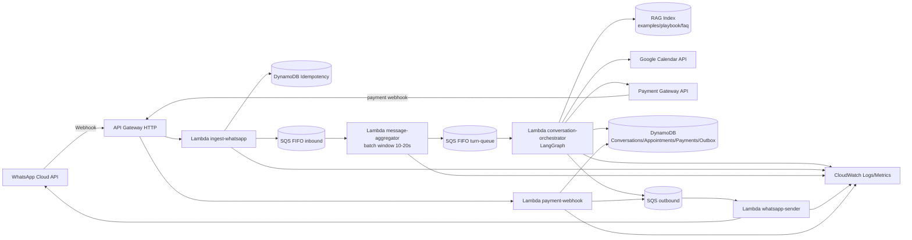

# Arquitetura - Secretária IA (MVP AWS)

## Objetivo
Arquitetura de baixo custo e alta confiabilidade para atendimento via WhatsApp, com LangGraph para diálogo e decisões de tools, mantendo fluxos críticos determinísticos (agendamento e pagamento).

## Premissas do MVP
- Canal inicial único: WhatsApp Cloud API.
- Deploy em AWS `us-east-1`.
- 1 nutricionista por tenant no início (expansível).
- Confirmação de pagamento somente por webhook do gateway.

## Diagrama de Componentes

## Componentes e Responsabilidades

### 1) `ingest-whatsapp`
- Valida assinatura do webhook da Meta.
- Normaliza payload de entrada.
- Deduplica por `channel_message_id`.
- Publica evento em `SQS FIFO inbound`.

### 2) `message-aggregator`
- Agrupa mensagens da mesma sessão por janela curta (10-20s).
- Emite um único turno para processamento, reduzindo respostas quebradas.

### 3) `conversation-orchestrator` (LangGraph)
- Interpreta intenção.
- Decide uso de tools (`calendar_search`, `calendar_book`, `payment_generate`, `notify_nutri`, `rag_retriever`).
- Persiste estado da conversa e solicita envio de mensagens via outbox.

### 4) `payment-webhook`
- Processa eventos do gateway de forma determinística.
- Valida assinatura do gateway e deduplica `gateway_event_id`.
- Atualiza status de pagamento/agendamento e envia confirmação.

### 5) `whatsapp-sender`
- Consome outbox e envia mensagens.
- Implementa retry e idempotência de envio.

## Princípios Arquiteturais
- Fluxo crítico determinístico, linguagem natural assistida por LLM.
- Idempotência ponta a ponta (entrada, tools sensíveis e saída).
- Event-driven com SQS FIFO para ordem por sessão.
- Observabilidade desde o dia 1 (logs estruturados + métricas + alarmes).

## Modelo de Dados (alto nível)
- `Conversations`: estado atual da sessão (`session_id`).
- `Messages`: histórico com TTL.
- `Appointments`: fonte de verdade do agendamento (`appointment_id`).
- `Payments`: eventos e status de pagamento.
- `Outbox`: mensagens pendentes de envio.
