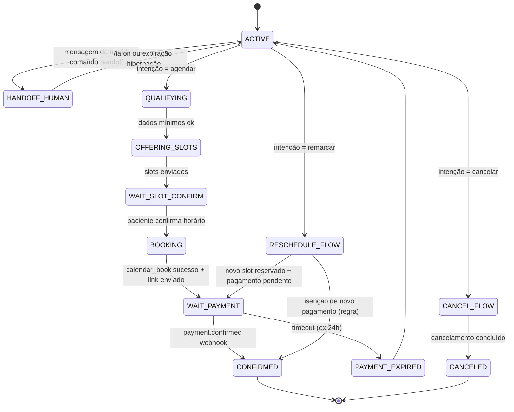
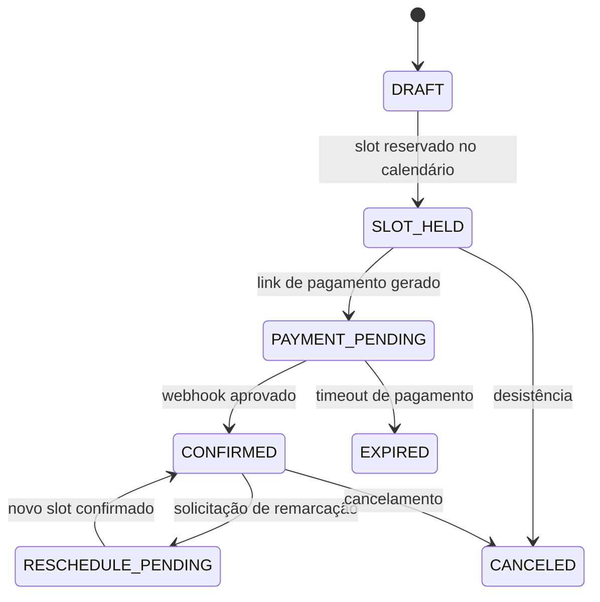

# Máquina de Estados (MVP)

## Objetivo
Definir transições seguras para conversa e domínio de agendamento/pagamento, separando decisão conversacional (LLM) de confirmação crítica (determinística).

## 1) Máquina de Conversa

## 2) Máquina de Domínio (Agendamento/Pagamento)

## Guardrails Obrigatórios
1. `CONFIRMED` só pode ser definido após evento válido de `payment-webhook`.
2. `calendar_book` só executa quando houver `slot_id` retornado por `calendar_search`.
3. Em `HANDOFF_HUMAN`, respostas automáticas ficam bloqueadas até comando de retorno.
4. Em timeout de pagamento, transição para `EXPIRED` e liberação de slot (se política exigir).

## Regras de Negócio Mínimas
- `slot_hold_ttl_minutes`: 15
- `payment_ttl_hours`: 24
- `max_reschedules`: 1 (MVP, configurável)
- Cancelamento com reembolso depende da política da clínica e gateway.
